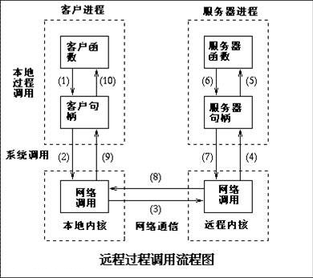

# RPC了解一下

[TOC]

## 0x00 RPC的诞生

了解RPC便应该了解一下它的历史，RPC(*Remote Procedure Call*，远程过程调用)最早可以追溯到快跨越半个世纪的1974年时发布的[RFC 674](https://datatracker.ietf.org/doc/rfc674)草案，这个草案并不是很出众的一个，但是确确实实的拉开了RPC的序幕。也便是今天我要讲给你的内容。

一个软件在开发的时候，我们比如想使用一个加密的算法，我们只需要在程序中加上这个加密算法就可以了；接下来，我可能要开发两个或者更多的程序在一台计算机上，都需要这个加密的算法，那我可以把这个算法单独抽象出来，放到一个独立的程序里面，其他的程序在调用这个算法的时候，可以使用IPC(*Inter-Process Communication*，进程间通信)的方法；但是，随着互联网的发展，计算服务逐渐的从单机服务转向了多机的服务，我们就需要在不同的计算机间进行通信，这便是RPC的思想诞生。

## 0x01 RPC 流程走一遍？



1.调用客户端句柄；执行传送参数

2.调用本地系统内核发送网络消息

3.消息传送到远程主机

4.服务器句柄得到消息并取得参数

5.执行远程过程

6.执行的过程将结果返回服务器句柄

7.服务器句柄返回结果，调用远程系统内核

8.消息传回本地主机

9.客户句柄由内核接收消息

10.客户接收句柄返回的数据

## 0x02 grpc 玩一玩

这里我将使用grpc+python3作为演示一个简单的rpc调用过程。

```shell
# 下载代码
$ git clone https://github.com/ctudoudou/grpc-python-demo.git
# 准备一个虚拟环境
$ python3 -m venv venv
$ source venv/bin/activate
# 安装需要的依赖包
$ pip install grpcio-tools
# 编译gRPC代码，生成helloworld_pb2.py和helloworld_pb2_grpc.py（仓库中已经有了，可以自己在尝试编译，以检查环境是否正确）
$ python3 -m grpc_tools.protoc --proto_path=.  --python_out=. --grpc_python_out=. helloworld.proto
# 运行服务
$ python greeter_server.py
# 再来一个终端
$ python greeter_client.py
 Greeter client received: Hello, you!
```

## 0x03 参考

1. [grpc python快速开始](https://grpc.io/docs/quickstart/python.html)
2. [分布式计算编程模型之 RPC](https://www.infoq.cn/article/2016%2F04%2FDistributed-compute-program-RPC)

